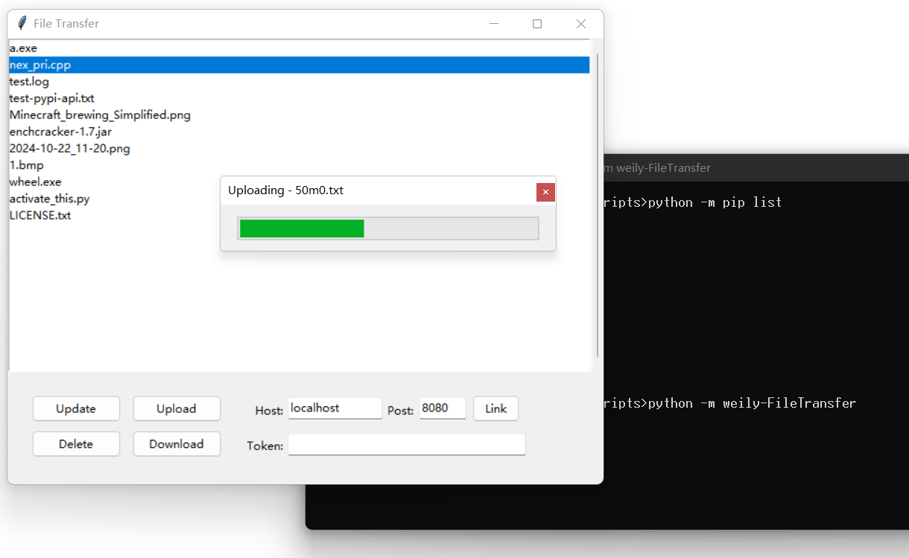

# 文件传输器

用于在学校机房传输文件。

使用命令行启动，不带任何参数默认以客户端启动，设置 `-s` / `--server` 启动服务端。前者有 UI，后者仅在命令行显示简单日志。

具体地，使用 `-h` / `--help` 查看详细信息：

```text
Launch the File Transfer, which defaults to starting in client mode.

options:
  -h, --help            show this help message and exit
  -s, --server          start in server mode
  -i HOST, --host HOST  set the server name
  -p POST, --post POST  set the communication port
  --timeout TIMEOUT     set the timeout in second
  --backlog BACKLOG     Maximum number of connections, only effective
                        when starting in server mode
  --superpasswd SUPERPASSWD
                        set a super password, only effective when starting
                        in server mode
```

使用 `-i` 和 `-p` 设置服务器名称和端口号。使用 `--timeout` 和 `--backlog` 设置超时限制和端口通信限制，这两项建议使用默认值。另外，使用 `--superpasswd` 设置一个超级密码，默认不存在。

## 细节

实现了 4 种请求：获取文件列表、上传文件、删除文件、下载文件。

实现了简单的权限控制：若上传文件时指定了非空密码，则删除文件或下载文件时要提供相同密码，或者提供超级密码。



## Bugs

+ ~~上传大文件时可能显示超时，这时文件可能实际成功上传；也可能显示断开连接，这时文件上传失败。可以尝试增大超时限制，注意客户端设置限制必须比服务端长。~~ `0.2.0` 版本解决中（正在测试）。

## 许可证

项目主体使用 [SATA](https://github.com/zTrix/sata-license) 许可证，如果你觉得我的项目有用，请为我点赞。

SATA 基于 MIT 许可证，即允许你在保留原始版权通知和许可条款的前提下，自由地使用、复制、修改、合并、出版发行、散布、再授权和/或销售软件及其副本。
